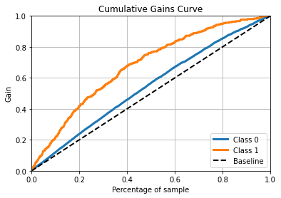

# Lending Club Loan Data

## By Srujana
### December 15,2020

[LendingClub](https://www.lendingclub.com/) was an American peer-to-peer lending company and the world's largest lending platform, where investors can search and browse the loan listings on the LendingClub website and select loans that they wanted to invest in based on the borrower information.As explained by [Wikipedia](https://en.wikipedia.org/wiki/LendingClub).

The goal of this project is to predict the probability that a loan will charge off. Here, the target variable is **loan_status**. for that reason we are keeping loan_status as either *fully paid* or *charge off*. This project will help investors to make better decisions while investing in borrowers. This dataset has 2 million rows and 151 columns.

## Main Results

Using the random forest classifier, we were able to achieve an ROC-AUC of 0.65 and an Precision-Recall-AUC of .31.If you look at the cummulative gains curve, we find that selecting the top 20% based on the model's prediction can capture 35% of the true cases (i.e. customers who actually defaulted) in the hold out set.

## References

LendingClub Data   [https://www.kaggle.com/wordsforthewise/lending-club]

Kernel Source [https://www.kaggle.com/pileatedperch/predicting-charge-off-from-initial-listing-data]

## Analysis

This project contains Loan_prepation where data preparation takes place and Loan_Model where data modeling happens.

In **Loan_Preparation**

:white_check_mark: Removed the loan features with **>30%** missing data

:white_check_mark: Divided the data into numerical data and categorical data, then visualized features in bar plots, scatter charts, stacked bar plots

In **Loan_model**

:white_check_mark: Created dummy variables for categorical variables

:white_check_mark: Applied Random Forest algorithm on train and test data, obtained **AUCROC** of **0.72**

:white_check_mark: I found that the top **5** features are
interest rate, debt to income ratio, days from issue to earliest credit lines, revolving line utilization rate, and account ratio.

:white_check_mark: Plotted ROC curve and Precision-Recall curve which is having **0.72** and **0.39** respectively
